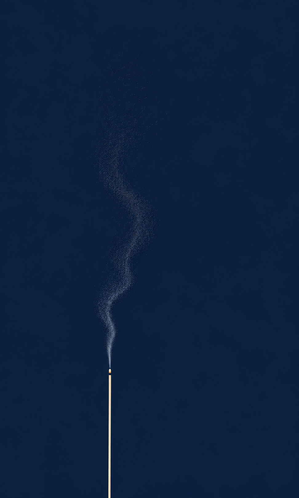
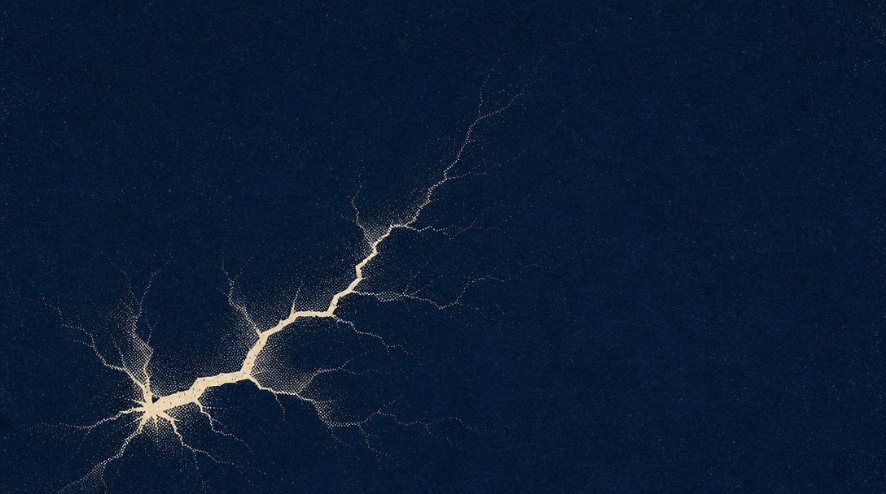
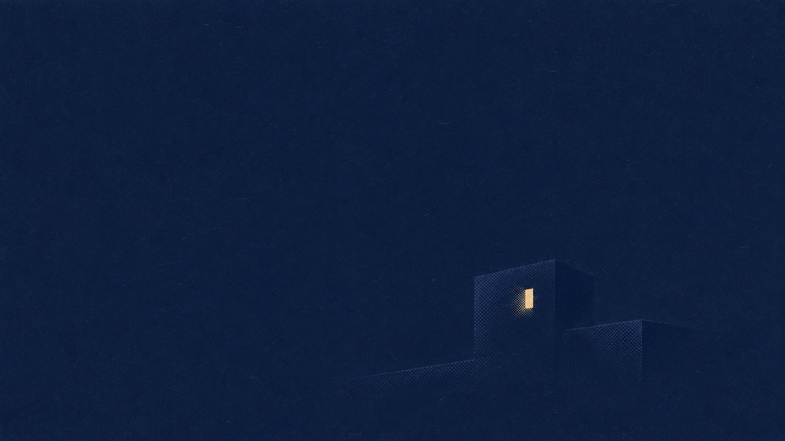
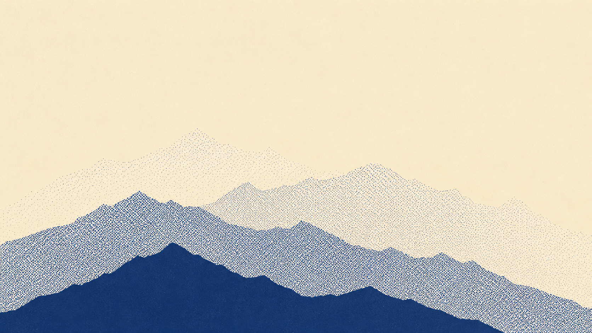
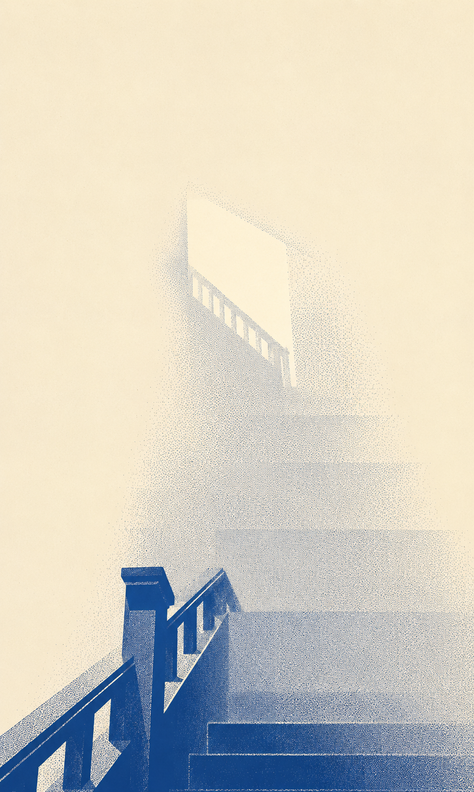
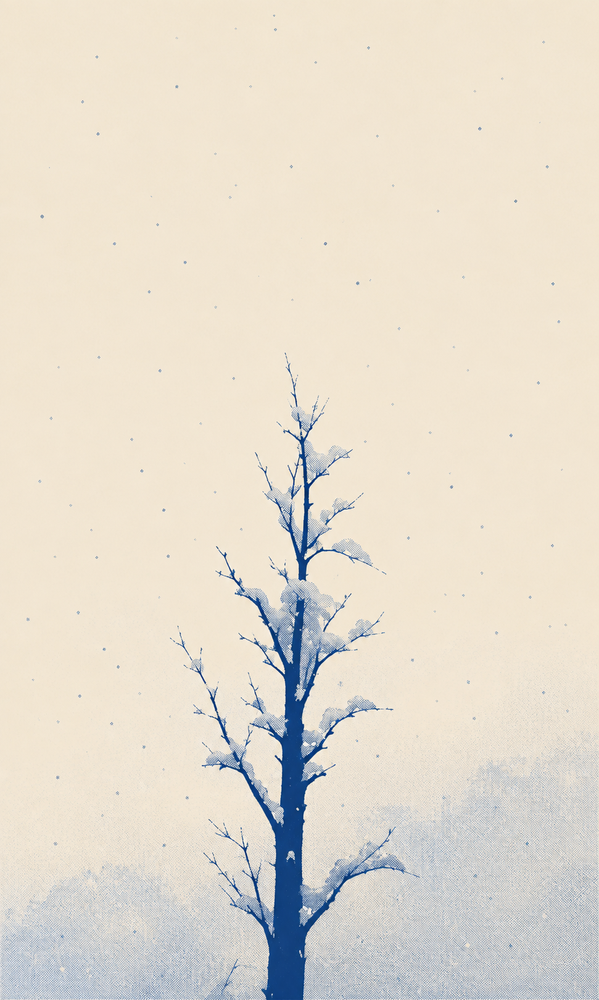

# Indigo Riso Poster

一句主题词，变成一张限定"靛蓝 + 米白"双色系的极简海报。

不是滤镜，不是风格迁移。核心是一套丝网印刷（riso print）双色套印的视觉语法：用网点疏密代替传统渐变，用严格的色彩纪律和留白比例，对抗 AI 图像生成里默认的堆砌感与光滑感。

<p align="center">
  
  
</p>

## 这是什么

输入一句话、一个意象、一种情绪——不需要参考图——生成一张遵循严格约束的双色海报：

- **色彩纪律**：只用靛蓝家族 + 米白，三套预设色卡，每套色卡永远只有 Ground（纸基）/ Ink（主墨）/ Mist（雾层）三个角色
- **网点渐变**：所有的"渐变"都不是模糊出来的，是网点从实色到稀疏到消失，密度变化必须跟着物理逻辑走（扩散方向、光源、空气透视）
- **留白优先**：主体锚点通常不超过画面 5%-45%，取决于构图类型，大面积留白是这套系统的呼吸感来源
- **默认配文**：每张图自带一句极简文字（落款/呼应/节奏三选一），文字与画面一次生成，共享同一层纸墨颗粒，不是后期贴上去的说明
- **专色点缀（Accent）**：唯一允许跳出色系的例外，条件卡得很死——只能是光源语义、全图一处、面积极小

详细规则见 [`SKILL.md`](SKILL.md) 和 `references/` 目录。

## 效果预览

**横版**

<p align="center">
  
  
</p>
<p align="center">
  
  
</p>
<p align="center">
  
</p>

**竖版**

<p align="center">
  
  
  
  
  
</p>

## 安装

```bash
git clone https://github.com/NeekChaw/indigo-riso-poster-skill.git
mkdir -p ~/.codex/skills
cp -R indigo-riso-poster-skill ~/.codex/skills/
```

如果 Skill 没有立即出现，重启客户端。

## 使用

```
用 $indigo-riso-poster-skill 生成一张海报：凌晨四点的写字楼，只有一层灯还亮着
```

```
用 $indigo-riso-poster-skill，竖版，意象是一支线香，烟从香头升起，越往上越散
```

Skill 会先确认色卡和构图类型（可以直接说"雾山晨蓝版"这样的色卡名，也可以让它按意象自动推荐），然后返回：

1. 生成图
2. 完整生成 prompt（方便微调重跑）
3. 一句话创作阐释

## 结构

```text
indigo-riso-poster-skill/
├── SKILL.md                        # 核心工作流与硬性约束
├── references/
│   ├── color-cards.md              # 三套色卡精确色值、Ground 动态范围、Accent 规则
│   ├── halftone-spec.md            # 网点渐变技术规范（结构性边缘 vs 扩散性边缘）
│   ├── prompt-template.md          # 中英文生成提示词模板
│   └── typography-spec.md          # 配文排版规范（角色驱动，非固定模板）
└── assets/
    └── examples/                   # 本 README 中的 8 张展示图
```

## 设计原则

这套系统靠约束立身，不是靠某个好看的 prompt 词。核心判断标准始终是：

- 颜色跳出蓝白色系了吗？——除非是明确定义的专色点缀，否则不允许
- 用了传统模糊渐变代替网点吗？——不允许，除非是判定为"结构性边缘"（如建筑、窗户，物理上本就该清晰）
- 主体占比超过留白纪律了吗？——不同构图类型有各自的硬性面积上限
- 文字是不是随手贴上去的说明？——文字要有角色（落款式 / 呼应式 / 节奏式），不是标题+说明的堆叠

反面清单、常见翻车模式、逐条自查方法详见各 `references/` 文件。

## License

MIT License

Copyright (c) 2026 两斤 (@0x00_Krypt)

Permission is hereby granted, free of charge, to any person obtaining a copy
of this software and associated documentation files (the "Software"), to deal
in the Software without restriction, including without limitation the rights
to use, copy, modify, merge, publish, distribute, sublicense, and/or sell
copies of the Software, and to permit persons to whom the Software is
furnished to do so, subject to the following conditions:

The above copyright notice and this permission notice shall be included in
all copies or substantial portions of the Software.

THE SOFTWARE IS PROVIDED "AS IS", WITHOUT WARRANTY OF ANY KIND, EXPRESS OR
IMPLIED, INCLUDING BUT NOT LIMITED TO THE WARRANTIES OF MERCHANTABILITY,
FITNESS FOR A PARTICULAR PURPOSE AND NONINFRINGEMENT. IN NO EVENT SHALL THE
AUTHORS OR COPYRIGHT HOLDERS BE LIABLE FOR ANY CLAIM, DAMAGES OR OTHER
LIABILITY, WHETHER IN AN ACTION OF CONTRACT, TORT OR OTHERWISE, ARISING FROM,
OUT OF OR IN CONNECTION WITH THE SOFTWARE OR THE USE OR OTHER DEALINGS IN
THE SOFTWARE.

---

若公开分享，欢迎标注来源。
